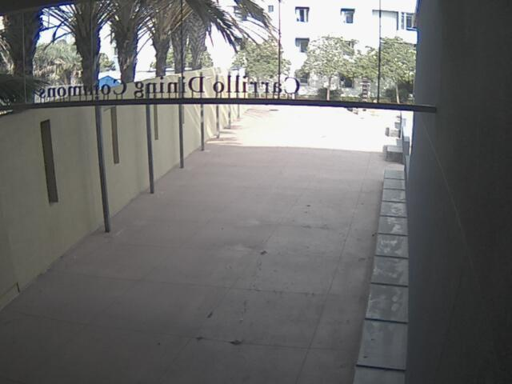
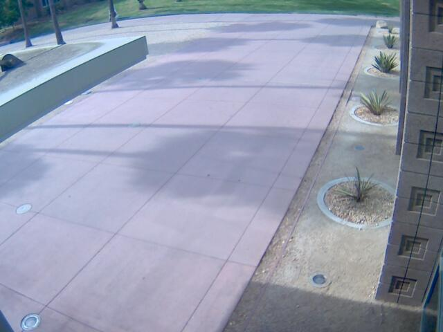
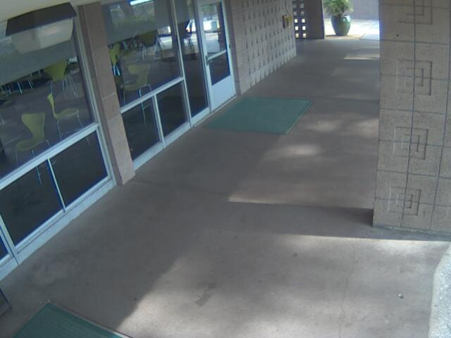

# UCSB Meal Time
Determining wait times at UCSB dining halls via computer vision

---
## Changelog
Next up
- automate image collection based on dining hall open hours
- add stream capability to `dining_hall_cams` module

08/20/18
- created `dining_hall_cams` module
    + save still images from dining hall camera feed
    + checks if dining hall is open at a given time
- recorded UCSB dining hall operating hours into `data/ucsb_dining_hall_hours.csv` ([source](http://www.housing.ucsb.edu/dining/dining-commons-hours%E2%80%94academic-year))
---

## Data 
UCSB has recently released a series of APIs, [one of which](https://developer.ucsb.edu/apis/dining/dining-cams-v1) provides feeds from [cameras at Carrillo, DLG, and Ortega dining halls](http://www.housing.ucsb.edu/dining/dining-cams).

Here are examples of stills from each of the cameras retrieved by `get_sample_images.py` which demonstrates usage of the `dining_hall_cams` module.

Carrillo:  

DLG:  

Ortega:  

## Requirements
### Data retrieval module
- during dining hall open hours, automatically collect still images for training
- get video feed

### Computer vision modeling
- image classification with classes {'no line', 'short line', 'long line'}
- object detection to count number of people in line

### Model retraining
- automatically retrain model on a monthly (?) basis with additional images collected since last training

